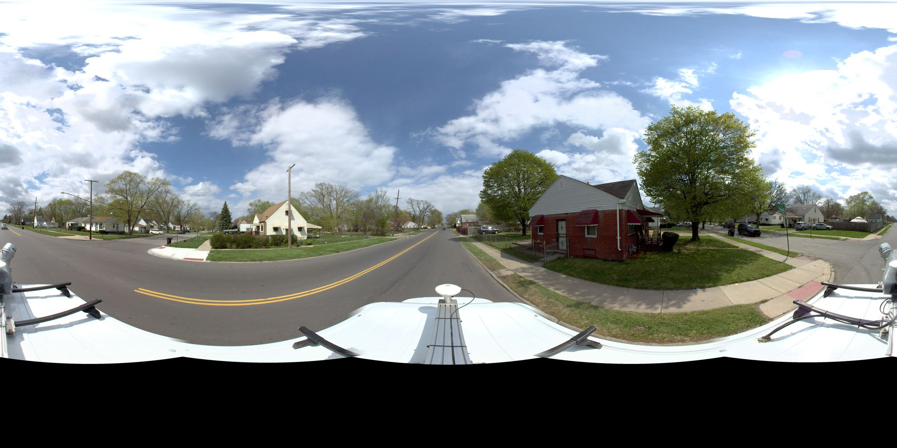
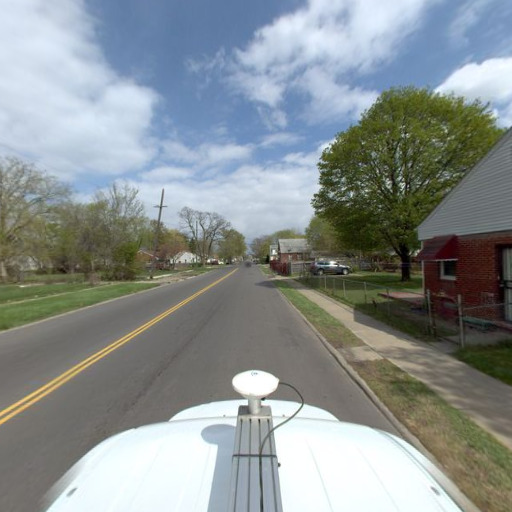
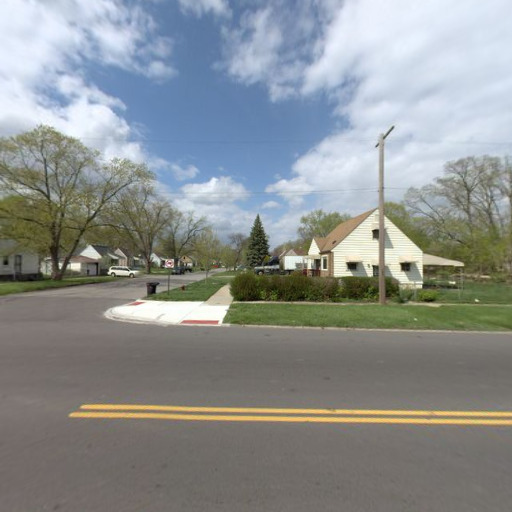
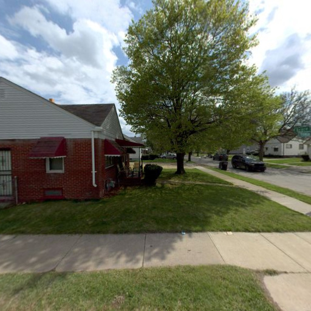
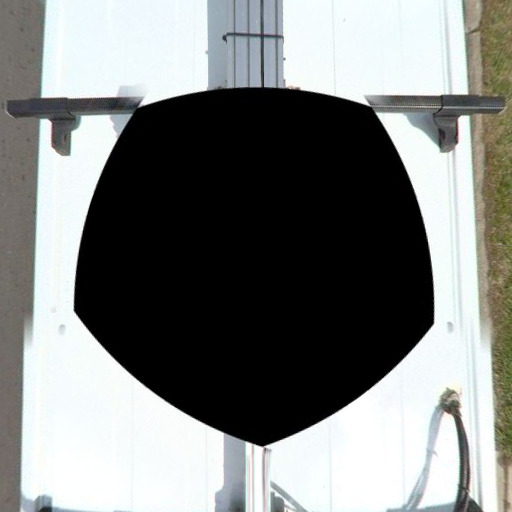
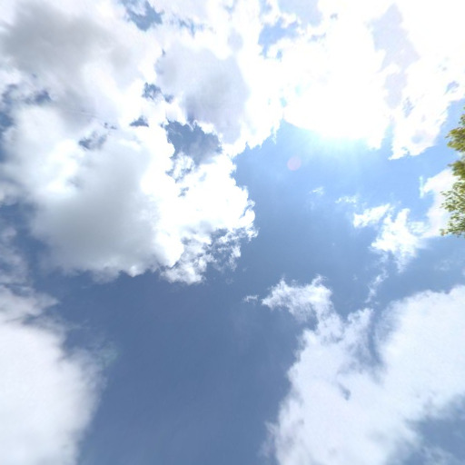

# Spherical to simple side images

Bunch of scripts to process and convert Mapillary spherical images into cube imagen and then into simple images for specific area in Mapillary API.

## Build container

```sh
export MAPILLARY_ACCESS_TOKEN="MLY|..."
docker-compose build
```

### 1. Download points from Mapillary into geojson file

```
bash ./01_get_mapillary_points.sh
```

From the `01_get_mapillary_points` bash:

| COMMAND                 | REQUIRED | DESCRIPTION                                              |
| -----------------       | -------- | -------------------------------------------------        |
| --output_file_point     | no       | point file path                                          |
| --output_file_sequence  | no       | sequence file path                                       |
| --bbox(*)               | no       | boundary bbox                                            |
| --geojson_boundaries(*) | no       | boundary (this file could contain many boundaries)       |
| --field_name            | no       | a field name from GeoJSON boundaries                     |
| --organization_ids(**)  | no       | filter by organization id from Mapillary                 |
| --timestamp_from(***)   | no       | filter by timestamp in milliseconds                      |
| --only_pano             | no       | filter by panoramic image                                |

( * ) These two commands are excludable, if one is used the other is no longer used.

( ** ) Download the short area in order to recognize the organization id, after check out if the organization id belongs to the required organization `https://graph.mapillary.com/$ORGANIZATION_ID?access_token=$TOKEN&fields=name`.

( *** ) Convert the human date to timestamp (milliseconds) [here](https://www.epochconverter.com/). 

### 1.5. Custom sequences from points
```
bash ./01.5_custom_sequence.sh
```

From the `01.5_custom_sequence` bash:

| COMMAND                 | REQUIRED | DESCRIPTION                                              |
| -----------------       | -------- | -------------------------------------------------        |
| --geojson_points        | yes      | point file path                                          |
| --output_file_sequence  | no       | custom sequence file path                                |

In Mapillary, many sequences have a frontal view (road) of street-view imagery. These sequences are not useful for us when we want to label the facade building or lots, so we can remove them.

In order to delete unnecessary sequences, it is necessary to have the generated custom sequence files and upload them to the tool. We have 2 tools that help us to do it:
1. A plugin in JOSM to be able to see an image of a sequence and to be able to delete it if necessary (download it from s3://ds-data-projects/JOSM/osm-obj-info.jar). 

2. An [app](https://filter_sequences.surge.sh/) that allows us to load GeoJSON files and view random images of a sequence, it allows us to delete sequences by marking with a check.


### Simplify density of points

```sh
docker run -v $PWD:/mnt/ -it developmentseed/spherical2images:v1 \
    simplify_points \
        --input_points=data/Warrendale_points_filter.geojson \
        --output_points=data/Warrendale_simplify.geojson
```

### Clip Pano images into left an right side

```sh
docker run -v $PWD:/mnt/ -e MAPILLARY_ACCESS_TOKEN=$MAPILLARY_ACCESS_TOKEN -it developmentseed/spherical2images:v1 \
    clip_mapillary_pano \
        --input_file_points=data/Warrendale_points_filter.geojson \
        --image_clip_size=1024 \
        --output_file_points=data/Warrendale_points_fixed.geojson \
        --output_images_path=data/ \
        --cube_sides=right,left
```

_Note_
For converting spherical-pano image to cubemap image, we are using [py360convert](https://github.com/sunset1995/py360convert):

## Example:

- Mapillary spherical-pano image:



- Cube:

|               Front                |                Back                |
| :--------------------------------: | :--------------------------------: |
|  |  |

|               Left                |               Right                |
| :-------------------------------: | :--------------------------------: |
|  |  |

|               Under                |               Over                |
| :--------------------------------: | :-------------------------------: |
|  |  |
